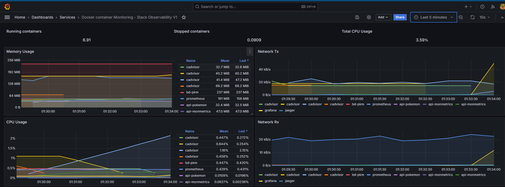
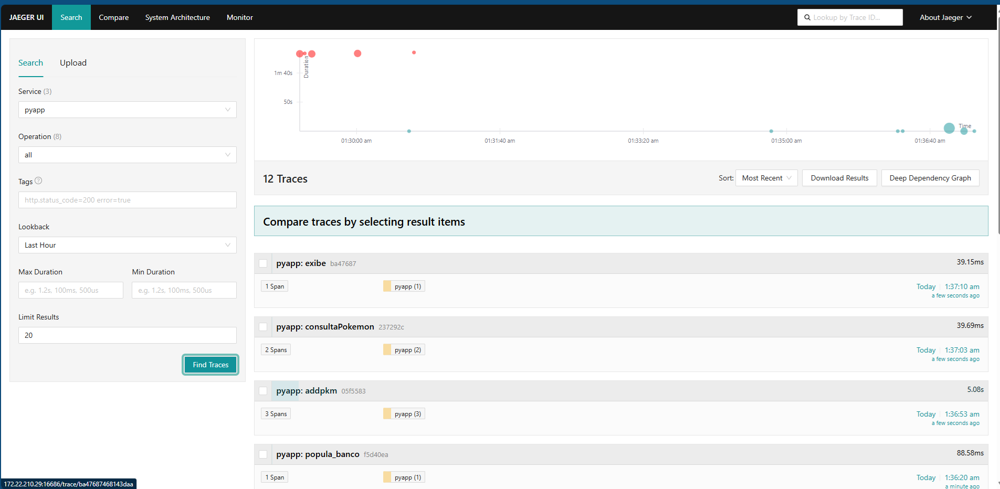
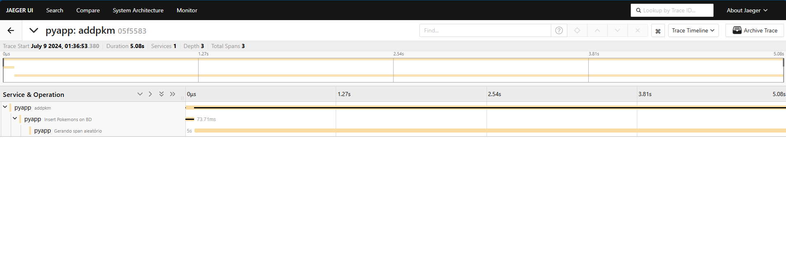

:computer: STACK DE OBSERVABILIDADE :computer:
## _Projeto para estudo de metologias de monitoramento_

---
Este projeto consiste em subir uma Stack de observabilidade e estudar seus principais conceitos, expondo a prática alinhada com metologias.
---

## Descrição - Resumo geral

Será usado neste projeto: AWS, Terraform, Github e Github Actions, Docker, Python, Grafana, Prometheus, Jaegger e cAdvisor. A base desse projeto é a API em Python, simulando uma aplicação com conexões simples com um banco de dados (mysql) onde através dela será possível consultar um pokemon pelo ID da Pokedex.
Essa API irá funcionar de forma containerizada, juntamente com toda a sua Stack. 

## Features
- API retorna o nome de um Pokemon com base em seu ID da National Pokedex. 

## Stack de observabilidade

A API será monitorada utilizando o Prometheus e Jaeger: 

- Jaeger: Irá monitorar os tracings da aplicação. No código estão exemplos de instrumentalização manual e automática.
- Prometheus: Irá expor métricas customizáveis da aplicação. No código estão exemplos de instrumentalização manual e exposição automática
- Grafana: Irá conter dashboards para visualização de dados expostos pelo Prometheus e pelo cAdvisor
- cAdvisor: Funcionará para coletar métricas do estado dos containers, garantindo monitorando de CPU, Memória e disco deles.


## Infraestrutura

Todo esse projeto poderá rodar localmente em uma máquina que contenha as versões mais atualizadas do Docker e Docker compose, porém, esta primeira versão foi pensada para rodar em uma EC2 na AWS. As futuras versões irão rodar em Kubernetes e (talvez) Elastic Beanstalk/ECS. As instruções par os SETUPS estão abaixo:

## SETUP AWS - RODANDO EM AWS EC2

Para rodar esse projeto em uma EC2, será necessáiro provisionar uma instância T2.Micro (para se manter no free tier, porém, poderá ter problema de performance com os containers, comento isso na sessão "Performance issues" logo abaixo). O arquivo "main.tf" conterá uma infraestrutura básica na AWS com os seguintes elementos: 

- VPC + subnet pública + Route table
- Security group (beeem permissivo, leia o código antes de aplica-lo em sua conta.)
- Internet Gateway
- EC2

## Infraestrutura - Particularidade da EC2
A EC2 já sobe com um setup (via terraform mesmo) para instalação do Docker e do Docker-compose e para o checkout do código fonte . Para isso, é necessário criar uma Chave privada, adiciona-la no seu repositório ou localmente, e aponta-la na linha 120 do arquivo "main.tf". Optei por fazer assim para testar um conceito, porém não é o melhor modo de fazer. Você pode usar o "user data" junto com o Terraform. Basta retirar o trecho de código entre a linha 117 e linha 135 do arquivo "main.tf" e adicionar a linha abaixo. Dessa forma é muito mais seguro do que usar uma chave EC2 e mais automático:

```
user_data = "${file("script.sh")}"
```

## Peformance Issues:
Com uma instancia t2.micro, os containers poderão rodar com lentidão devido ao comportilhamento de memória. Pensando nisso, você pode alterar o compose.yaml definindo uma sessão de "deploy" para controlar o memória RAM provisionada. Nessa versão do projeto, limitei apenas o container do banco de dados. Basta reproduzir as mesmas linhas de código para cada container. Se atente ao recomendável para os containers como Grafana, cAdvisor e Prometheus. As aplicações não consomem nada de memória. 


## Installation
Presumo que tenha o terraform instalado em sua máquina, caso não tenha, veja o link: [Install terraform](https://developer.hashicorp.com/terraform/install).
Com o terraform pronto, você precisará criar três variáveis de ambiente (ou poderá utilizar a configuração padrão do seu AWSCLI instalada em sua máquina). As variáveis são:


- Remote State Terraform - S3 - Opcional
Como este projeto também tem o intúito de automatizar o deploy da aplicação usando github actions, o gerenciamento de estado do terraform está sendo através do S3. Você pode mudar para as opções que o terraform oferece. 

## Pipeline - Github actions
Neste projeto, na pasta .github/workflows haverão dois arquivos: um serve para subir toda a infraestrutura, o outro servirá para destruir toda ela. Esse workflow só é acionado manualmente. Fique a vontade para adicionar outras funcionalidades.

Para ele funcionar corretamente, você precisará adicionar SECRETS em seu repositório. As secrets são:

```
AWS_ACCESS_KEY_ID="sua_access_key"
AWS_SECRET_ACCESS_KEY="sua_secret_key"
AWS_REGION="us-east-1"
```
Feito isso, a pipeline já irá funcionar corretamente. Uso uma Action do Terraform para provisionar a infraestrutura. 


## SETUP LOCAL - Rodando com docker
Para rodar localmente basta você ter o docker engine instalado em sua máquina e também o docker compose. Dentro do diretório, rode o seguinte comando: 

```
docker compose -f compose.yaml up -d --build
```


## Aplicações e suas portas
Essa stack irá inicializar 7 containers. Abaixo segue a descrição de como acessa-los: 

| SERVICE | PORT |
| ------ | ------ |
| api-prometheus | 8689 |
| apimon | 5000 |
| Grafana | 3000 |
| Prometheus | 9090 |
| Jaeger | 16686 |
| cAdvisor | 8080 |


## Acessando os serviços
### GRAFANA
Acesse o grafana pelo endereço do seu host (aws ou local) na porta 3000. A senha é a padrão da imagem [Consulte aqui](https://hub.docker.com/r/grafana/grafana)

### PROMETHEUS
O servidor Prometheus pode ser acessado na porta 9090. Verifique os Targets dele para se certificar de que todos os containers estão expondo as métricas corretamente.


### APIPROMETHEUS e APIMON
As aplicações podem ser acessadas nas portas 8689 e 5000. Elas são micro APIs que só servem para gerar dados.


## Melhorias
- As aplicações em Python serão melhoradas, adicionando funcionalidades à elas (novas rotas, novas features)
- Essas aplicações terão mais métricas com o passar do tempo, e a ideia é adicionarmos outras fontes para o monitoramento (new relic, dynatrace, etc)
- Esse projeto será modificado para ser utilizado em outras infraestruturas, como Kubernetes, ECS e mais.
- Painel de alertas e notificações via Telegram
- Novos dashboards com métricas, et

## Screenshots
- Grafana dashboard


- Exemplo 1 - Jaeger


- Exemplo 2 - Jaeger
